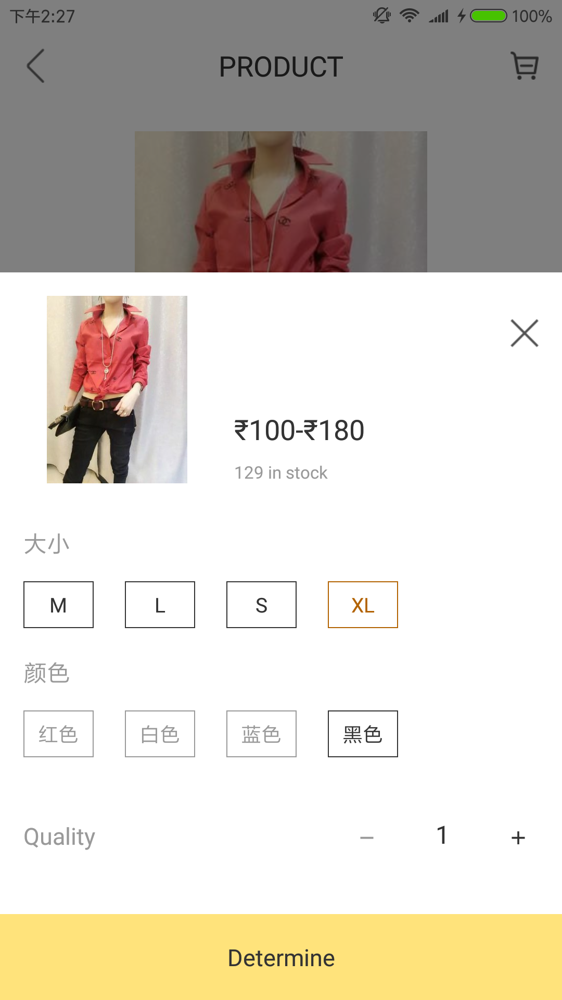

# Sku
Android Sku Selector, 类似于淘宝，天猫，京东，支持多维属性，支持MVVM架构




绑定数据
-------

```java
SkuSelectScrollView.setSkuList(List<Sku> skuList);
```


设置监听
-------

```java
SkuSelectScrollView.setListener(new OnSkuListener() {
    @Override
    public void onUnselect(SkuAttribute unselectAttribute) {}

    @Override
    public void onSelect(SkuAttribute selectAttribute) {}

    @Override
    public void onSkuSelected(Sku sku) {});
```

使用MVVM架构 
---------- 
  
组件提供[SkuViewProxy](library/src/main/java/com/wuhenzhizao/widget/SkuViewProxy.java)来对MVVM数据绑定进行支持  

```xml
<com.wuhenzhizao.widget.SkuSelectScrollView
    xmlns:sku="http://schemas.android.com/apk/res-auto"
    android:id="@+id/sku_databinding"
    android:layout_width="match_parent"
    android:layout_height="wrap_content"
    android:layout_marginTop="50dp"
    sku:skuList="@{vm.skuList}"
    sku:skuViewProxy="@{vm.proxy}" />
```